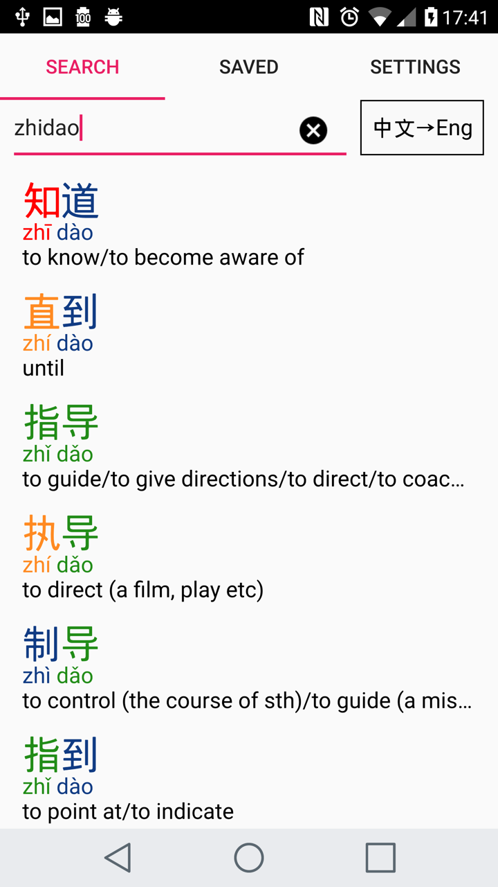

Chinese-English Dictionary for Qt
=================================

v1.1 12 April 2008
------------------

This application is a Chinese<->English dictionary app built using Qt 5 and Qt Quick Controls 2.
It uses the dictionary data compiled by the [CC-CEDICT](https://cc-cedict.org/wiki/) project.

This application is based on ["Chinese-English Dictionary for N9"](http://badpint.org/chinesedict/), which was written for Nokia's short-lived MeeGo OS.

So far it has been tested on Android.



Features
--------
- Search by English or Chinese, using characters or Pinyin (with or without tones)
- Works completely offline
- Supports simplified or traditional characters
- Customisable support for tone colouring of characters and Pinyin

Usage should be pretty self-explanatory.


Directory structure
-------------------

```
app/
```
 The actual application code.

```
test/
```
A set of tests, mainly of the Pinyin parsing functions.  Relies on GoogleTest.

```
dbcreator/
```
A standalone program which generates the 'words.db' SQLite database.

```
data/
  cedict_ts.u8
  internet-zn.num
```
Textual source data used by dbcreator: A CC-CEDICT file (downloaded on 02/04/2018) and a word frequency file from http://corpus.leeds.ac.uk/list.html


```
googletest-release-1.8.0
```
A copy of GoogleTest, used by the test project.

```
sqlite-amalgamation-XXXXXX
```
A copy of SQLite.  A complete SQLlite implementation is linked into the application.


The license for the application code is GPLv2.
There are some icons from the Material design project copied into the app/ directory, these are covered by the Apache License Version 2.0](https://www.apache.org/licenses/LICENSE-2.0.txt)
